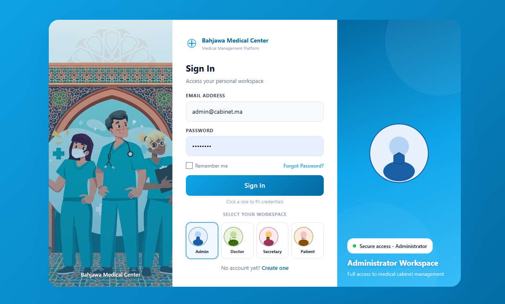
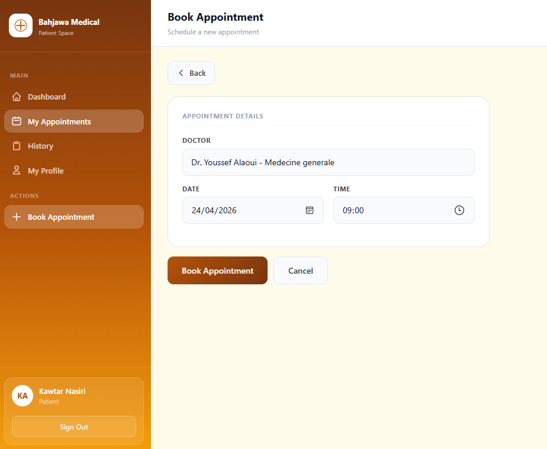

# 🏥 Bahjawa Medical Center

**Application web de gestion d'un cabinet médical** développée avec Laravel 13, PHP 8.4, MySQL, Tailwind CSS et DomPDF.

🌐 **Lien de l'application déployée :** [https://medical-center-bahjawi.up.railway.app](https://medical-center-bahjawi.up.railway.app)

---

## 📸 Aperçu de l'application
 

  
   
  <em>Figure 1 : Interface de connexion utilisateur</em>

  
   
  <em>Figure 2 : Dashboard principal - Vue d'ensemble du cabinet</em>

 

  
   
  <em>Figure 3 : Interface de gestion des rendez-vous</em>

 

---

## ✨ Fonctionnalités

### 👥 Authentification multi-rôles
| Rôle | Accès |
|------|-------|
| 👑 Admin | Accès total à toutes les fonctionnalités |
| 👨‍⚕️ Médecin | Consultation des patients, prescriptions, gestion des disponibilités |
| 📋 Secrétaire | Gestion des rendez-vous, saisie des patients |
| 🧑 Patient | Prise de rendez-vous, historique, ordonnances |

### 🔧 Modules principaux

- ✅ **Gestion des utilisateurs** (CRUD complet)
- ✅ **Gestion des rendez-vous** avec statuts (en attente, confirmé, annulé)
- ✅ **Gestion des consultations médicales**
- ✅ **Génération de prescriptions/ordonnances en PDF** (DomPDF)
- ✅ **Gestion des disponibilités des médecins**
- ✅ **Notifications email** (Mailtrap en environnement local)
- ✅ **Dashboard avec statistiques** pour chaque rôle
- ✅ **Espace patient** avec historique et prise de rendez-vous
- ✅ **Export PDF** des ordonnances

---

## 🛠️ Stack technique

| Catégorie | Technologie |
|-----------|-------------|
| Backend | Laravel 13.5, PHP 8.4 |
| Base de données | MySQL 8.0 |
| Frontend | Tailwind CSS 3.4, Blade Templates |
| PDF Generation | barryvdh/laravel-dompdf |
| Email | Mailtrap (SMTP sandbox) |
| Déploiement | Railway (Docker) |
| Versioning | Git / GitHub |

---

## 📦 Installation locale

### Prérequis
- PHP 8.4+
- Composer
- MySQL 8.0+
- Node.js & NPM
